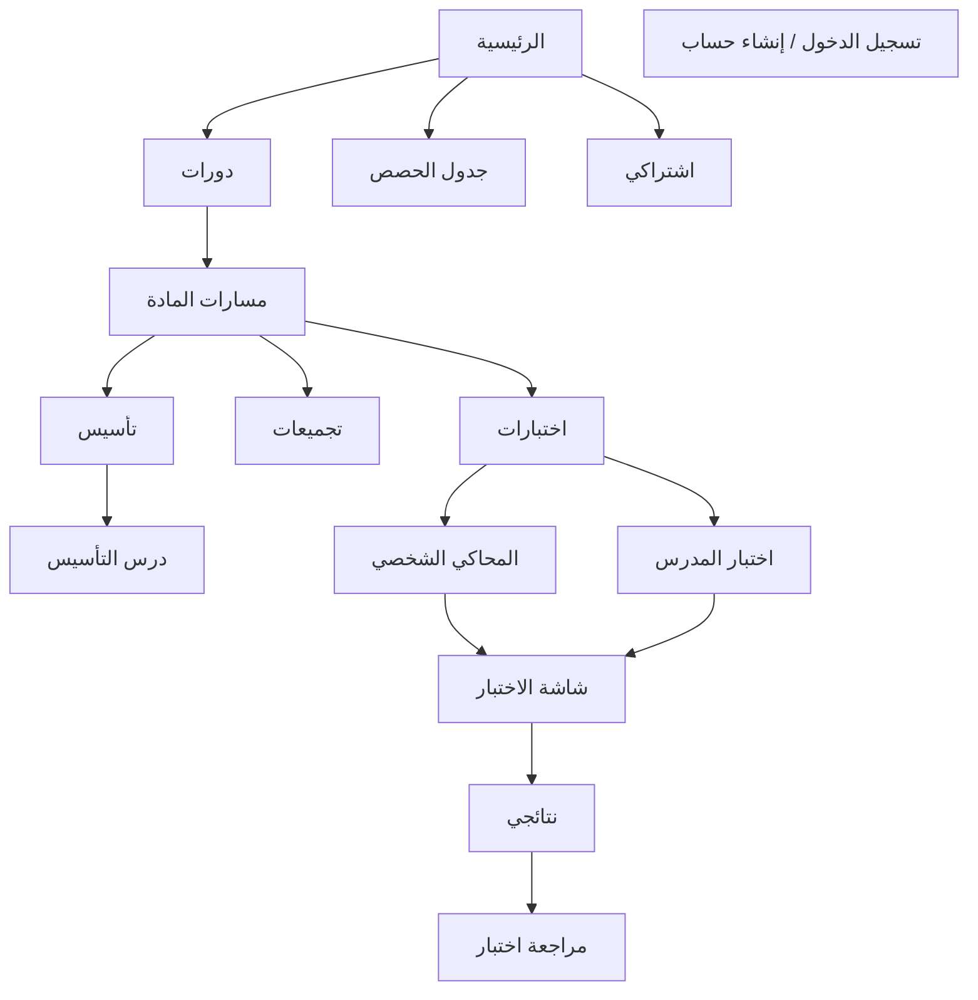

# منصة التعلم — Full Mockup Documentation

Extracted from:
- [canva-mockups.html](canva-mockups.html) — Desktop (1440×1024) + embedded mobile preview
- [canva-mockups-mobile.html](canva-mockups-mobile.html) — Mobile (375×812)
- [canva-mockups-tablet.html](canva-mockups-tablet.html) — Tablet (768×1024)

---

## 1. Project Overview

| Property | Value |
|---|---|
| **Platform name** | منصة التعلم (Learning Platform) |
| **Purpose** | Canva-ready HTML mockups for screenshot import |
| **Language** | Arabic (`lang="ar"`, `dir="rtl"`) |
| **Subjects** | رياضيات، فيزياء، كيمياء، أحياء (Math, Physics, Chemistry, Biology) |
| **Usage** | Open in browser at 100% zoom → screenshot each frame → upload to Canva |

### File Cross-References
Each file links to the other two variants in its index page.

---

## 2. Design System

### 2.1 Color Tokens (CSS Variables)

| Token | Hex | Usage |
|---|---|---|
| `--primary` | `#2563EB` | Brand blue, buttons, active states |
| `--primary-dark` | `#1D4ED8` | Gradient end, hero backgrounds |
| `--primary-light` | `#DBEAFE` | Active nav, selected answers, preset cards |
| `--bg` | `#F8FAFC` | Page background inside frames |
| `--surface` | `#FFFFFF` | Cards, headers |
| `--border` | `#E2E8F0` | Borders, dividers |
| `--text` | `#0F172A` | Primary text |
| `--text-muted` | `#64748B` | Secondary text |
| `--success` | `#16A34A` | Correct answers, live badge, active subscription |
| `--error` | `#DC2626` | Wrong answers |
| `--warning` | `#F59E0B` | Timer, warning boxes |
| Body wrapper bg | `#1e293b` | Dark slate outside frames |

### 2.2 Typography
- **Fonts:** Cairo (400, 600, 700) + Tajawal (desktop only)
- **Direction:** RTL throughout
- **Logo icon:** Letter `ت` in blue square

### 2.3 Border Radius
- `--radius-sm`: 8px
- `--radius-md`: 12px
- `--radius-lg`: 16px
- Chips: 999px (pill)

### 2.4 Shadows
- `--shadow`: `0 2px 8px rgba(0,0,0,0.08)`
- `--shadow-lg`: `0 8px 24px rgba(0,0,0,0.12)`

### 2.5 Frame Dimensions

| Breakpoint | Width | Height | Border/Style |
|---|---|---|---|
| Desktop | 1440px | 1024px | 8px radius, shadow |
| Tablet | 768px | 1024px | 12px radius, shadow |
| Mobile | 375px | 812px | 24px radius, 8px solid `#0f172a` bezel |

### 2.6 Course Cover Gradients
- **Math:** `#1e40af` → `#3b82f6`
- **Physics:** `#7c3aed` → `#a78bfa`
- **Chemistry:** `#059669` → `#34d399`
- **Lesson thumb default:** `#1e3a5f` → `#2563EB`
- **PDF/homework thumb:** `#64748b` → `#94a3b8`

### 2.7 Shared UI Components
- **Header (desktop):** 64px, logo + nav + auth/avatar
- **Header (tablet):** 60px, compact nav
- **Header (mobile):** 56px, hamburger menu + title + avatar
- **Bottom nav (mobile only):** 60–64px — الرئيسية، دورات، نتائج، جدول، اشتراكي
- **Buttons:** primary (blue fill), secondary (white + border), ghost (transparent)
- **Chips:** filter pills with active state
- **Cards:** white surface, border, shadow
- **Avatar:** Circle with letter `م` (student initial)

---

## 3. Global Navigation

### Desktop / Tablet Top Nav

| Link | Arabic |
|---|---|
| Home | الرئيسية |
| Courses | دورات |
| Results | نتائج |
| Schedule | جدول الحصص / جدول |
| Subscription | اشتراكي |

### Mobile Bottom Nav
الرئيسية · دورات · نتائج · جدول · اشتراكي

### Auth Actions
- **Guest:** "تسجيل الدخول / إنشاء حساب" button
- **Logged in:** Avatar `م`

---

## 4. Information Architecture & User Flows

### Course Path Logic (from mockup copy)
1. **تأسيس (Foundation):** Numbered lessons — video, PDF, homework (MCQ). Teacher can add/edit.
2. **تجميع (Collections):** Same lesson names as تأسيس, with difficulty levels (سهل / متوسط / صعب). Questions sourced from teacher test bank.
3. **اختبارات (Tests):** Two modes — Personal Simulator or Teacher Test.

---

## 5. Screen Inventory

### Desktop (`canva-mockups.html`) — 16 screens

| # | ID | Screen | Frame |
|---|---|---|---|
| 01 | `home-desktop` | الرئيسية / Dashboard | 1440×1024 |
| 01b | `home-mobile` | الرئيسية (embedded mobile) | 375×812 |
| 02 | `courses` | الدورات — subject picker | Desktop |
| 03 | `subject-hub` | مسارات المادة — رياضيات | Desktop |
| 04 | `taasees` | تأسيس — lesson list | Desktop |
| 05 | `lesson` | درس التأسيس | Desktop |
| 06 | `tagmeeat` | تجميعات | Desktop |
| 07 | `tests-hub` | اختبارات hub | Desktop |
| 08 | `simulator` | المحاكي الشخصي setup | Desktop |
| 09 | `teacher-test` | اختبار المدرس setup | Desktop |
| 10 | `test-runner` | شاشة الاختبار (active test) | Desktop |
| 11 | `results` | نتائجي — test list | Desktop |
| 11b | `results-detail` | مراجعة اختبار | Desktop |
| 12 | `schedule` | جدول الحصص | Desktop |
| 13 | `subscription` | اشتراكي | Desktop |
| 14 | `login` | تسجيل الدخول | Desktop |
| 15 | `register` | إنشاء حساب | Desktop |

### Mobile (`canva-mockups-mobile.html`) — 16 screens

| # | ID | Screen |
|---|---|---|
| 01 | `m-home` | الرئيسية |
| 02 | `m-courses` | الدورات |
| 03 | `m-subject` | مسارات المادة |
| 04 | `m-taasees` | تأسيس |
| 05 | `m-lesson` | الدرس |
| 06 | `m-tagmeeat` | تجميعات |
| 07 | `m-tests` | اختبارات |
| 08 | `m-simulator` | المحاكي الشخصي |
| 09 | `m-teacher-test` | اختبار المدرس |
| 10 | `m-test-runner` | شاشة الاختبار |
| 11 | `m-results` | النتائج |
| 12 | `m-results-detail` | مراجعة اختبار |
| 13 | `m-schedule` | جدول الحصص |
| 14 | `m-subscription` | اشتراكي |
| 15 | `m-login` | تسجيل الدخول |
| 16 | `m-register` | إنشاء حساب |

### Tablet (`canva-mockups-tablet.html`) — 16 screens

Same structure as mobile with `t-` prefix (`t-home` through `t-register`).

---

## 6. Screen-by-Screen Content Details

### 6.1 الرئيسية (Home / Dashboard)

**Hero — Next Class**
- Label: الحصة القادمة
- Subject: الرياضيات
- Date/time: السبت، 5 مايو · 6:00 مساءً (desktop) / 6:00 م (mobile/tablet)
- CTA: "رابط الحصة Zoom ↗" / "رابط Zoom"

**Quick Action (desktop only)**
- Card: 📝 اختبارات

**Browse by Subject**
- Chips: رياضيات (active), فيزياء (active on desktop/tablet), أحياء, كيمياء
- Level tabs (desktop only): 1 (active), 2, 3

**Suggested Lessons (الدروس المقترحة)**

| Lesson | Level/Duration | Type | Difficulty |
|---|---|---|---|
| مقدمة في التكامل | المستوى 1 · 12 دقيقة | Video ▶ | سهل |
| قواعد التفاضل | المستوى 2 · 18 دقيقة | Video ▶ | متوسط |
| واجب الوحدة 3 | PDF · واجب منزلي | PDF 📄 | — |
| تطبيقات التكامل | المستوى 3 · 22 دقيقة | Video ▶ | صعب |

---

### 6.2 الدورات (Courses)

- Title: دورات
- Subtitle: "اختر المادة — ثم تأسيس أو تجميع أو اختبارات"
- 4 subject buttons in 2×2 grid: رياضيات (primary/active), فيزياء, كيمياء, أحياء

---

### 6.3 مسارات المادة (Subject Hub — Math)

- Breadcrumb: دورات > رياضيات
- Title: رياضيات
- Path chips: تأسيس (active), تجميع, اختبارات
- Info card text: "تأسيس: دروس مرقمة — فيديو، PDF، واجب (أسئلة اختيار). التجميع: نفس الدروس بمستويات سهل/متوسط/صعب. الاختبارات: محاكي شخصي أو مدرس."

---

### 6.4 تأسيس (Foundation Lessons)

- Breadcrumb: دورات > رياضيات > تأسيس
- Title: تأسيس — رياضيات
- Teacher action: "إضافة درس" button

| # | Lesson | Content Types | Action |
|---|---|---|---|
| 1 | المعادلات الخطية | فيديو · PDF · واجب | تعديل / فتح |
| 2 | حل المعادلات | فيديو · واجب | تعديل / فتح |
| 3 | تطبيقات عملية | PDF | تعديل / فتح |

---

### 6.5 درس التأسيس (Lesson Detail)

- Breadcrumb: دورات > رياضيات > تأسيس > الدرس 1
- Title: الدرس 1: المعادلات الخطية
- Note: "المعلم يعدّل الاسم ويضيف المحتوى"
- Tabs: فيديو (active), PDF, واجب
- Video player placeholder (16:9 desktop, fixed height mobile/tablet)
- Homework note: "واجب: أسئلة اختيار من متعدد — المعلم يضيف عدد الأسئلة المطلوب"
- Teacher actions: إضافة فيديو, إضافة PDF, إضافة واجب (أسئلة)

---

### 6.6 تجميعات (Question Collections)

- Breadcrumb: دورات > رياضيات > تجميع
- Title: تجميعات — رياضيات
- Subtitle: "نفس أسماء دروس التأسيس — اختر درساً ثم المستوى"
- Lesson chips: المعادلات الخطية (active), حل المعادلات, تطبيقات عملية
- Difficulty chips: سهل, متوسط (active), صعب
- Content: "المعادلات الخطية — مستوى متوسط" — "سؤال 1 · سؤال 2 · سؤال 3 — أسئلة وضعها المعلم (مصدر اختبار المدرس)"

---

### 6.7 اختبارات Hub

- Breadcrumb: دورات > رياضيات > اختبارات
- Title: اختبارات
- Subtitle: "محاكي شخصي أو مدرس — من بنك التجميعات"

**Two test mode cards:**

| Mode | Description | CTA |
|---|---|---|
| المحاكي الشخصي | عدد الأسئلة، الدروس، المادة، المستوى — اختبار عشوائي | ابدأ الإعداد / إعداد |
| مدرس | معادلة صعوبة · مراجعة فورية أو نهائية | ابدأ الإعداد / إعداد |

**Recent tests (desktop):**
- محاكي · رياضيات — 8 أسئلة · 75% · 5 يونيو — [تفاصيل]

---

### 6.8 المحاكي الشخصي (Personal Simulator Setup)

Form fields:
- **المادة *** — dropdown: رياضيات
- **الدروس *** — multi-select: المعادلات الخطية، حل المعادلات
- **عدد الأسئلة *** — stepper: default 8 (− / +)
- **المستوى** — radio/chips: سهل, متوسط (checked), صعب
- Actions: إلغاء | ابدأ الاختبار ←

---

### 6.9 اختبار المدرس (Teacher Test Setup)

- Breadcrumb: دورات > رياضيات > اختبارات > مدرس
- Subtitle: "الأسئلة من بنك التجميعات حسب معادلة المستوى"

Form fields:
- **المادة *** — رياضيات
- **الدرس *** — المعادلات الخطية
- **عدد الأسئلة *** — 20

**Difficulty ratio presets:**

| Preset | Easy | Medium | Hard |
|---|---|---|---|
| سهل | 70% | 20% | 10% |
| متوسط (selected) | 35% | 45% | 20% |
| صعب | 20% | 40% | 40% |

**Review mode:**
- فورية — بعد كل سؤال (checked)
- نهائية — في آخر الاختبار

CTA: "ابدأ اختبار المدرس" (full width)

---

### 6.10 شاشة الاختبار (Test Runner)

**Header bar:**
- Title: محاكي شخصي · رياضيات
- Progress: سؤال 3 من 8
- Timer: ⏱ 12:34 (warning color)
- Button: إنهاء

**Progress bar:** 37% filled

**Question panel:**
- Video hint banner: "🎬 فيديو توضيحي قبل الإجابة · مشاهدة"
- Question: "ما هي نتيجة تكامل الدالة f(x) = 2x بالنسبة لـ x؟"
- Options:
  - أ) x² + C
  - ب) 2x² + C **(selected)**
  - ج) x²/2 + C
  - د) 2x + C

**Question map (desktop sidebar / mobile grid):**
- Q1, Q2: answered (green border)
- Q3: current (blue fill)
- Q4–Q8: unanswered

**Footer:** ← السابق | تخطي | التالي →

---

### 6.11 نتائجي (Results List)

- Title: نتائجي
- Subtitle: "كل اختبار باسمه — اضغط لمراجعة إجاباتك"

| Test | Score | Date | Errors | Action |
|---|---|---|---|---|
| محاكي — المعادلات الخطية | 75% | 5 يونيو | خطأان | مراجعة |
| مدرس — حل المعادلات | 68% | 3 يونيو | 6 أخطاء | مراجعة (highlighted) |
| محاكي — تطبيقات عملية | 90% | 1 يونيو | خطأ واحد | مراجعة |

---

### 6.12 مراجعة اختبار (Results Detail)

- Breadcrumb: نتائج > مدرس — حل المعادلات
- Summary: 68% · 14 صحيح · 6 خطأ
- Filter chips: الكل (active), الأخطاء فقط
- Button: رجوع للقائمة

**Review items:**

| Q# | Status | User Answer | Correct | Correction tabs |
|---|---|---|---|---|
| 1 | صحيح | أ | — | تصحيح كتابي (active), تصحيح فيديو |
| 2 | خطأ | ب | ج | تصحيح كتابي (active), تصحيح فيديو + explanation text |
| 3 | صحيح | د | — | — |
| 4 | خطأ | أ | ب | تصحيح كتابي (active), تصحيح فيديو |

---

### 6.13 جدول الحصص (Schedule)

- Title: جدول الحصص
- View toggle: قائمة (active), تقويم

**Today (اليوم):**
- 6:00 م — الرياضيات — الأستاذ أحمد · 60 دقيقة — **مباشر الآن** badge — [انضم عبر Zoom]

**Tomorrow (غداً):**
- 5:00 م — فيزياء — الأستاذة سارة · 45 دقيقة — [انضم عبر Zoom]
- 7:30 م — كيمياء — الأستاذ خالد · 50 دقيقة — [تذكير]

---

### 6.14 اشتراكي (Subscription)

**Active subscription card:**
- Status: الاشتراك نشط
- Plan: سنوي
- Expires: 15 ديسمبر 2026
- Remaining: 198 يوم
- CTA: تجديد الاشتراك

**Plan options:** شهري | فصلي | **سنوي** (selected/highlighted)

**Payment gateways:**
- بطاقة بنكية
- فودافون كاش
- محفظة إلكترونية

CTA: إتمام الدفع والاشتراك

---

### 6.15 تسجيل الدخول (Login)

| Field | Placeholder |
|---|---|
| البريد الإلكتروني | example@email.com |
| كلمة المرور | •••••••• |

- CTA: تسجيل الدخول
- Link: "ليس لديك حساب؟ إنشاء حساب"

---

### 6.16 إنشاء حساب (Register)

| Field | Required | Input |
|---|---|---|
| الاسم | * | الاسم الكامل |
| رقم التليفون | * | 01xxxxxxxxx |
| الجنس | * | ذكر (default) / أنثى |
| البريد الإلكتروني | * | example@email.com |
| كلمة المرور | * | •••••••• |

- CTA: إنشاء الحساب
- Link: "لديك حساب؟ تسجيل الدخول"

---

## 7. Responsive Differences Summary

| Feature | Desktop | Tablet | Mobile |
|---|---|---|---|
| Screens count | 16 | 16 | 16 |
| Navigation | Top horizontal nav | Compact top nav | Hamburger + bottom nav |
| Test runner | Full layout + sidebar | Stacked + question grid | Stacked + compact grid |
| Schedule | Full list + calendar toggle | List view | List view |
| Results review detail | Full per-question review | Compact cards | Compact cards |
| Simulator / Teacher setup | Full forms | Form card layout | Stacked form |
| Subscription layout | 3-col plans + payment row | Split 2-column | Stacked, 2 plans only |
| Lesson grid | 4 columns | 2 columns | 1 column |
| Register gender | Radio buttons | Chips | Chips |

---

## 8. Business Rules (Inferred from Mockups)

1. **Four subjects** with identical path structure (تأسيس → تجميع → اختبارات).
2. **Foundation lessons** are numbered and teacher-editable (video, PDF, MCQ homework).
3. **Collections** mirror foundation lesson names with 3 difficulty tiers.
4. **Teacher test questions** come from the collections bank.
5. **Personal simulator** pulls random questions by subject, lessons, count, and difficulty.
6. **Teacher test** uses difficulty ratio presets and supports immediate or final review.
7. **Test runner** may require watching an explainer video before answering.
8. **Results** support written and video corrections per question.
9. **Live classes** integrate Zoom with live/scheduled states.
10. **Subscription** is required — monthly, quarterly, or annual plans with local payment methods (Egypt-focused: Vodafone Cash).

---

## 9. Sample Data Reference

| Entity | Sample Values |
|---|---|
| Student avatar | م |
| Teachers | الأستاذ أحمد, الأستاذة سارة, الأستاذ خالد |
| Dates | 1–5 يونيو 2026 (test results), 5 مايو (next class), 15 ديسمبر 2026 (subscription end) |
| Test scores | 75%, 68%, 90% |
| Question counts | 8 (simulator), 20 (teacher test) |
| Session durations | 60, 45, 50 minutes |

---

## 10. Print / Export Notes

Desktop file includes `@media print` rules:
- Hides page index
- White background, no shadows
- Page break after each screen wrapper

**Canva workflow:** Screenshot each `.frame-desktop`, `.frame-mobile`, or `.frame-tablet` at **100% browser zoom**.
